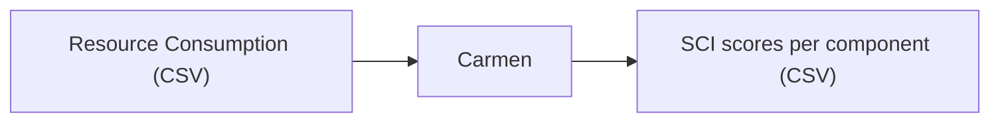

# Quick Start Guide

This guide gets you from zero to your first carbon report in under 15 minutes, then points you at the right next steps for real-world use.

## Before you start: is Carmen the right tool?

Carmen is an **engineering tool**, built by engineers for engineers. It is for **optimisation and introspection** — identifying concrete parts of your infrastructure where you can reduce emissions. Florent Morel, one of its creators, describes it as *"the opposite of greenwashing."*

Carmen is probably **not** the right tool if you need:

- Carbon figures for corporate/ESG reporting
- Numbers for a press release or marketing material
- Compliance or regulatory disclosures

Carmen **is** the right tool if you want to:

- Know which services, VMs, or pods in your stack emit the most CO2
- Compare components and prioritise reductions
- Feed per-component carbon scores into your own FinOps dashboards or internal tooling
- Give developers granular, actionable insights into the carbon footprint of their code

If you're unsure, keep reading — the example below takes a few minutes and makes the output very concrete.

## How Carmen works


That's it. Carmen is a **CSV-in, CSV-out engine**. There is no built-in dashboard, no vendor connector, no UI. The input and output are both CSV files and everything between is Carmen.

A few concepts to anchor on before you run anything:

| **Concept** | **What you need to know** |
| --- | --- |
| **UID = component** | Carmen scans the Id column of your input CSV and generates one Impact Framework component per unique value. The number of unique UIDs is the granularity of your measurement. |
| **Time resolution** | Carmen currently reports **daily totals** (24h buckets). |
| **Two modes** | **Daemon mode** = infra-level reporting from FinOps/VM-usage CSVs. **API mode** = granular, container-level metrics from Prometheus for optimising specific services. |
| **Benchmark machine** | Daemon mode can run against a *benchmark* hardware config when you don't have real VM specs. Real cloud specs (e.g. from the Azure API) give you more accurate numbers; without them Carmen falls back to defaults. |
| **Cloud or on-prem** | Carmen doesn't care where your workloads run. If you can get your data into the expected CSV shape, Carmen can score it. |

The "magic" — and the reason Carmen scales to thousands of servers where plain Impact Framework cannot — is that it **builds IF manifest files at runtime**. You never write them by hand.

## Prerequisites

- [Git](https://git-scm.com/)
- [Python 3.12](https://www.python.org/)
- [Python package manager (pip)](https://pypi.org/project/pip/)
- [Node package manager (npm)](https://www.npmjs.com/)

**Windows users:** 

Carmen runs natively on Windows and the instructions below include Windows variants, but the smoothest experience is via [**WSL2**](https://learn.microsoft.com/en-us/windows/wsl/install). Install WSL2 with a Linux distribution (Ubuntu is a good default) and then follow the Linux/macOS commands throughout this guide. This sidesteps the Windows-specific gotchas listed at the end.

## Steps

### Step 1 — Install the Impact Framework

Carmen runs on top of [Impact Framework](https://github.com/Green-Software-Foundation/if). Install it (and the plugins Carmen depends on) globally:

```bash
$ npm install -g "@grnsft/if" "@grnsft/if-plugins" "@grnsft/if-unofficial-plugins"
```

### Step 2 — Install Carmen

Clone the repository and install from source inside a virtual environment to keep dependencies isolated.

#### **Linux / MacOS:**

```bash
$ git clone https://github.com/Green-Software-Foundation/if-carmen.git

$ cd if-carmen

$ python -m venv .venv

$ source ./.venv/bin/activate

$ python -m pip install --upgrade pip

$ python -m pip install -e .
```

#### **Windows:**

```markdown
$ git clone https://github.com/Green-Software-Foundation/if-carmen.git

$ cd if-carmen

$ py -m venv .venv

$ .\.venv\Scripts\activate

$ .\.venv\Scripts\python.exe -m pip install --upgrade pip

$ .\.venv\Scripts\python.exe -m pip install -e .
```

### Step 3 — Run the example

The repository ships with sample data you can run against immediately. From the project root:

```bash
$ cd example-data

$ carbon-daemon
```

The daemon reads example-data/vm-metrics/vm_metrics_simple.csv (two VMs, three hours each) and writes a carbon report to example-data/output/.

### Step 4 — Inspect the output

Open the generated CSV at the path below relative to the project root. You should see one row per UID per day, with columns:

```bash
example-data/output/ (file name pattern: CO2_<date>.csv)
```

| **Column** | **What it means** |
| --- | --- |
| Date | The 24h reporting bucket |
| Id, Name | The component's unique identifier and human-readable name |
| EnergyKWH | Total energy consumed |
| OperationalCarbonGramsCO2eq | CO2 from electricity used during operation (adjusted for grid carbon intensity) |
| EmbodiedCarbonGramsCO2eq | CO2 from the manufacture, transport, and disposal of the hardware |
| TotalCarbonGramsCO2eq | Operational + embodied — your headline SCI score for that component, that day |
| CarbonIntensity | gCO2e/kWh for the region's grid |

Every number above is per-component and per-day. That's the raw material for everything else you'd build on top of Carmen.

### Step 5 — Point Carmen at your own data

Now let's point Carmen at your actual data. 

**The central integration challenge of Carmen is wrangling your data into the expected CSV shape** — once you can do that, everything else is mechanical.

The daemon expects columns like:

| **Column** | **Example** |
| --- | --- |
| Time | 2024-10-15T14:30:00Z |
| Id | vm-a1b2c3d4 *(this is the UID — drives component granularity)* |
| Size | Standard_D4s_v3 |
| Region | eastus, westeurope, ap-southeast-1 |
| Service, Component, Subscription, Name, Instance, Environment, Partition | organisational metadata |
| AverageCpuPercentage | 45.7 |
| DiskSizeGb | 128 |

See [docs/carmen-daemon.md](http://./carmen-daemon.md) for the full schema.

A practical recipe:

1. **Identify your data source.** Carmen was originally built to consume FinOps/billing data at Amadeus — cloud spend records mapped to VM usage. You might have cloud provider APIs, VM inventories, billing exports, or on-prem monitoring data.
2. **Decide your granularity.** Whatever you put in the Id column becomes a component. Per-VM is typical; you can go coarser (per service) or finer.
3. **Configure your benchmark machine** (or connect real hardware specs). If you don't supply real VM specs, Carmen uses a default benchmark config — useful for a first pass, but you'll want realistic hardware data for trustworthy numbers.
4. **Write a minimal config.yaml.** Start with the local-file example shipped in example-data/config.yaml; swap in your own paths. See [docs/configuration.md](http://./configuration.md) for all options, including Azure Blob Storage sources and uploads.
5. **Run carbon-daemon** and inspect the output.
6. **Iterate.** Feed the output into your existing FinOps dashboard, Grafana, internal reporting, or anything else that consumes CSV.

### Step 6 (optional) — Run Carmen in API mode

If you want **granular, container-level insights** — for example, a developer team wanting to optimise their own service — deploy Carmen as a sidecar in Kubernetes alongside a Prometheus instance.

This mode pulls CPU and memory metrics per pod at configurable intervals (not daily totals), and exposes them via a FastAPI service on http://localhost:8000/api/docs.

See [docs/carmen-as-a-service.md](http://./carmen-as-a-service.md) for the full walkthrough, including the Kubernetes/Prometheus prerequisites.

|  | **Daemon mode** | **API mode** |
| --- | --- | --- |
| **Best for** | Fleet-wide reporting | Optimising a specific service |
| **Data source** | FinOps / VM usage CSVs | Prometheus (container metrics) |
| **Granularity** | Per-VM, daily | Per-pod, configurable intervals |
| **Deploy as** | CLI / scheduled job | Sidecar container |

## Common gotchas

- **Your first report looks off.** Likely because you're running against the default benchmark hardware. Wire in real VM specs (e.g. from your cloud provider's API) before drawing conclusions.
- **Only one row per VM.** Check the Id column — that's the UID that controls component splitting.
- **Carmen emitted nothing.** Check that npm-installed @grnsft/if is on your PATH and that your config.yaml paths resolve from the directory you're running carbon-daemon in.
- **You want hourly numbers.** Carmen currently aggregates to daily totals. This is a known limitation.

### Windows-specific

- **npm install -g fails with EACCES or "access denied".** Run your terminal as Administrator, or reconfigure npm's global prefix to a user-writable directory (npm config set prefix %APPDATA%\npm).
- **carbon-daemon not found after install.** Make sure your virtual environment is activated (.\.venv\Scripts\activate) — Carmen's CLI entry points live in .venv\Scripts\ on Windows, not on the system PATH.
- **Backslashes in config.yaml paths.** YAML treats \ as an escape character inside quoted strings. Use forward slashes (./output, C:/data/carmen) even on Windows — they work fine.
- **Long-path errors during pip install or npm install.** Older Windows setups cap paths at 260 characters, and the .venv + node_modules trees can exceed it. Enable long paths: New-ItemProperty -Path "HKLM:\SYSTEM\CurrentControlSet\Control\FileSystem" -Name "LongPathsEnabled" -Value 1 -PropertyType DWORD -Force (admin PowerShell).
- **Still stuck?** Switch to WSL2 (see the note under Prerequisites) — it is the path of least resistance.

## Next Steps

| **What you need** | **Where to look** |
| --- | --- |
| GitHub Repository | https://github.com/Green-Software-Foundation/if-carmen |
| Full daemon docs | [if-carmen/docs/carmen-daemon.md](https://github.com/Green-Software-Foundation/if-carmen/blob/dev/docs/carmen-daemon.md) |
| API / sidecar docs | [if-carmen/docs/carmen-as-a-service.md](https://github.com/Green-Software-Foundation/if-carmen/blob/dev/docs/carmen-as-a-service.md) |
| All config options | [if-carmen/docs/configuration.md](https://github.com/Green-Software-Foundation/if-carmen/blob/dev/docs/configuration.md) |
| How the numbers are calculated | [if-carmen/docs/methodology.md](https://github.com/Green-Software-Foundation/if-carmen/blob/dev/docs/methodology.md) |
| How Carmen compares to other tools | [if-carmen/docs/comparison-with-other-tools.md](https://github.com/Green-Software-Foundation/if-carmen/blob/dev/docs/comparison-with-other-tools.md) |
| Contribute | [if-carmen/docs/CONTRIBUTING.md](https://github.com/Green-Software-Foundation/if-carmen/blob/dev/docs/CONTRIBUTING.md) |
| Carmen Community | https://grnsft.org/mov-plat-carmen |

You've now run your first carbon measurement with Carmen. If you're using it in your organisation or have questions, come and introduce yourself in the [Carmen community space](https://grnsft.org/mov-plat-carmen) — we'd love to hear how you're putting it to use.
